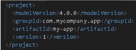
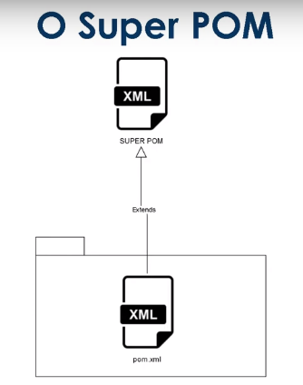

# General

The command teached in the course did not work. But I generated some Node.JS script to make the project generation more easy. The command of the [official documentation](https://maven.apache.org/archetypes/maven-archetype-quickstart/) worked.

The command is:

```
mvn archetype:generate "-DarchetypeGroupId=org.apache.maven.archetypes" "-DarchetypeArtifactId=maven-archetype-quickstart" "-DarchetypeVersion=1.5"
```

I saved this command in [this project](https://github.com/andreterceiro/dio-maven-helper-mvn). I have a working copy in the path `/srv/www/raiz/diversos/dio/java/maven/ask-paramaters`. Some parameter values above are only default values in the script.

I have a command to make a global shorcut. The command is `/bin/mvn-ask-parameters`. This command simply execute the command `node index.js` in the root of a working copy mentioned above.


## Maven commands

In the root directory of the generated project you can execute as example:

```
mvn clean
mvn compile
mvn test
mvn package
```

If you generated the project with the command `mvn-ask-parameters`, you can enter in the directory of the project created. And in the root directory you can execute the commands mentioned above.


### mvn clean

Clean the project and removes the `target` directory (maybe it does more things). As you can see [in this link](https://www.dio.me/articles/mvn-clean-install-and-mvn-clean-package-qual-a-diferenca), you can also execute `mvn clean package` and `mvn clean install`


### mvn compile

Compile, generate the `.class` files from the `.java` files. In the generated project we have only 1 `.java` file. And you can execute this `.class` file generated trough this commands as example:

```
cd artifactId/target/classes/
java packageGroupId.App
```


### mvn test

As you can see in the file `pom.xml` of the root directory of the generated project, `JUnit` is a dependency of the generated project. Then, as example **in this generated project**, `mvn test` executes the tests with `JUnit`. But `mvn test` function is to execute tests in general.

If you enconter errors on executing `mvn test` related to versions (talking in general), please try to execute before the command `mvn clean`. Please understand the impacts if you do this, as example the exclusion of the `target` directory.


### mvn package

Generates the `.jar` file. Please see the path in the output of this command.


## Other artifacts

You can see as example [here](https://maven.apache.org/archetypes/index.html) other artifacts. When you click in the link of an artifact you will can see the "`mvn`" command related to this artifact.

The instructor of the course also mentioned [this website](https://mvnrepository.com/).


## pom.xml

This is the main file used by Maven. The minimal `pom.xml` looks like this:



The `pom.xml` file works with inheritance. The "father" is `Super Pom`, related to a spectfic version of `Maven`:



The instructor mentioned [this site](https://maven.apache.org/ref/3.0.4/maven-model-builder/super-pom.html). You can override some configuration that you get from `Super Pom` through your `pom.xml`.

We can see in the `Super Pom` file that we have central repository. It make sense, right? When using `npm` or `compose` we do not have to configure a place to get the packages, we only install the packages :). But we can change this configuration.

[https://repo.maven.apache.org/maven2](https://repo.maven.apache.org/maven2/) is an example of central repository. You can access this link and you will see a website with links to the some packages (JUnit as example).

You can change this configuration in your `pom.xml` or in the file `settings.xml` (global, `mirror` xml node).

We have a local repository (for cache as example in `$HOME/.m2/repository` - Linux path, `HOME` in upper case).